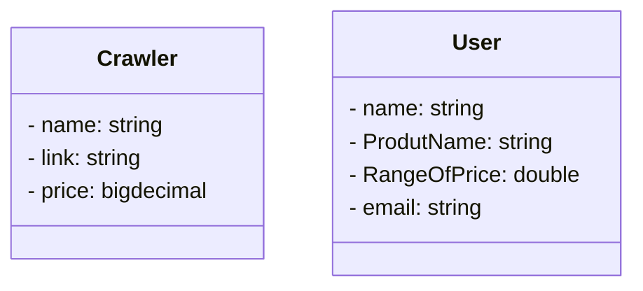

# O App Meu Preço Baixo 

## Principais tecnologias
- **Java 17**
- **Spring Boot 3**
- **Spring Data JPA**
- **Spring boot validation**
- **OpenAPI (Swagger)**
- **Mysql**
-  **Docker**
-  **Mailtrap**
-  **Kafka**

O App Meu Preço Baixo é uma versão embrionária de um agregador de preços, semelhante ao Buscapé. Ele permite aos usuários cadastrar produtos de interesse e definir alertas de preço para esses produtos. O sistema é composto por duas entidades principais:
  
Crawler:

    Atributos: Nome, Link, Preço.
    Funcionalidade: Realiza o cadastro de novos produtos.

Usuário:

    Atributos: Nome, Nome do Produto, Faixa de Preço, Email.
    Funcionalidade: Cadastra alertas de preço especificando os atributos mencionados. Os usuários também têm a capacidade de excluir os alertas criados.

## Funcionalidades do Sistema

- O sistema permite operações CRUD (Create, Read, Update e Delete) sobre os produtos cadastrados pelo Crawler.
- Os produtos e alertas são armazenados no banco de dados.
- Quando um novo produto é cadastrado, o sistema envia um evento para uma fila Kafka.
  - Quando esse evento é consumido, o sistema busca por correspondências (matches) com os alertas dos usuários.
  - Se ocorrer um match, um email é enviado para o usuário que cadastrou o alerta, informando que um produto de interesse está disponível com um preço dentro da faixa desejada.
- Quando um alerta de preço é cadastrado, o sistema envia um evento para a fila.
  - Quando esse evento é consumido, um email é enviado para o usuário, confirmando o sucesso do cadastro do alerta.
 
## Projeto em andamento sujeito a alterações em breve.

